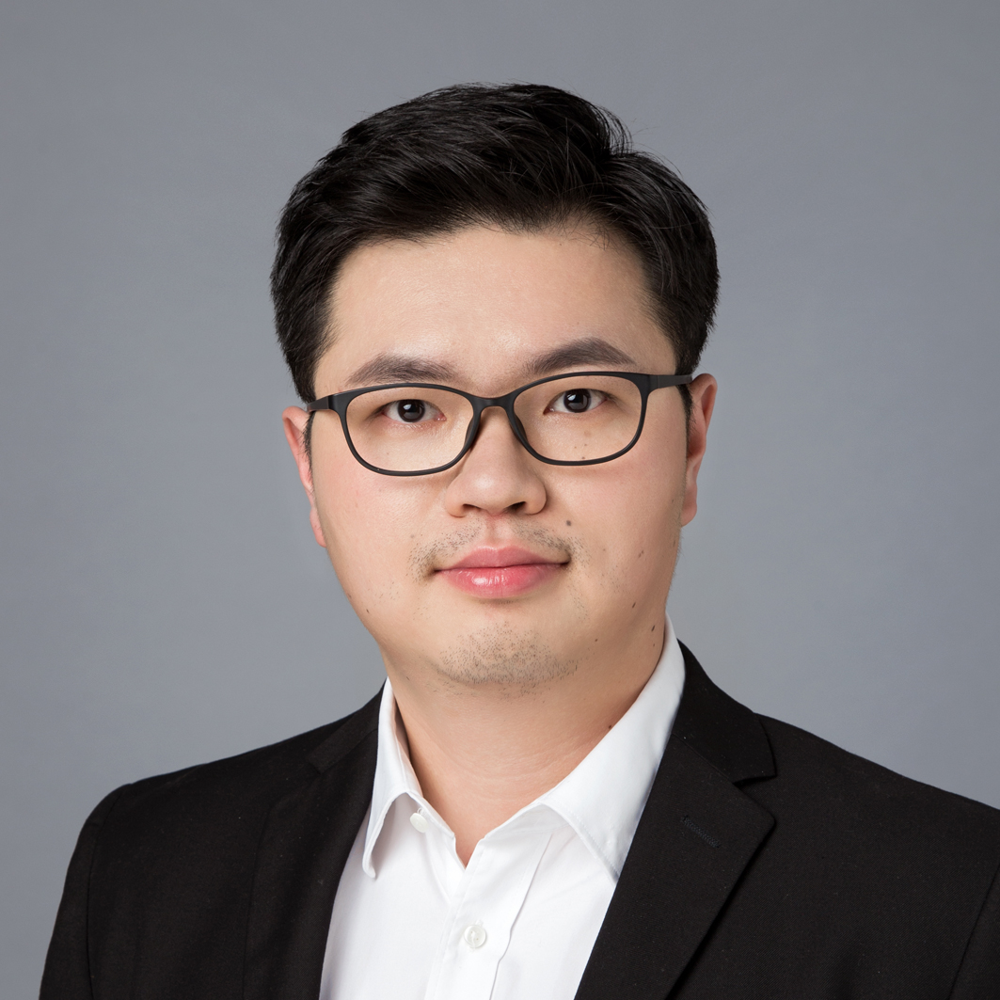

# Chixiao (Sirius) Chen, Ph.D

## Education

* 2006 - 2010 B.Sc, Fudan University, Microelectronics
* 2010 - 2016 Ph.D, Fudan University, Microelectronics

## Experience

* 2015 - 2016, Member of Founding Team, [Calterah Inc](http://www.calterah.com/).
* 2016 - 2018, Postdoc Research Associate, University of Washington, EE, [Silicon System Research Lab](http://labs.ece.uw.edu/ssrl/ssrl_website/Home.html)
* 2019 - 2021,  Assistant Prof, Fudan University, FAET & FICS
* 2022 - now, Associate Prof, Fudan University, [Frontier Institute of Chips and Systems (FICS)](http://fics.fudan.edu.cn)
* 2023 - now, Director of Chiplet Innovation Center, [State Key Laboratory of Integrated Chips and Systems](https://sklics.fudan.edu.cn/)

## Research Activity

* I serve as a reviewer for JSSC, TCAS-1, TCAS-2, JETCAS, TVLSI and DAC, and rewarded as a Top Reviewer from IEEE SSCS in 2023.
* I am a member of IEEE/CCF/CCAI.
* I was a TPC member of A-SSCC 2023/2024, APCCAS 2022, and a TPC-co-chair/Student Poster Chair of ICAC 2023/2024.

[Back to CiH Home](./)
