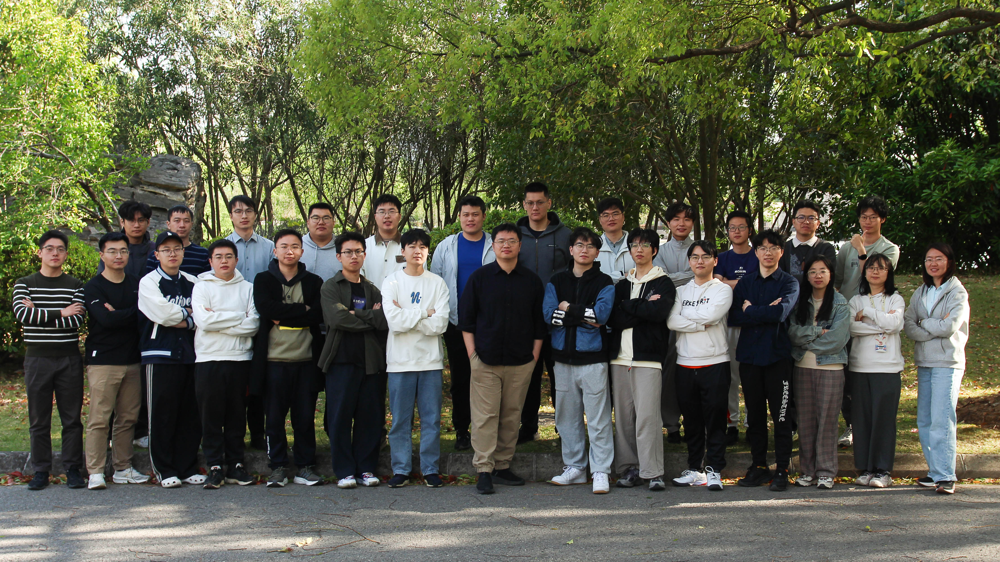

# Welcome to CiH-Lab @ FDU !

The CiH lab is from [College of Integrated Circuits and Nano-Micro Electronics（集成电路与微纳电子创新学院）](https://icmne.fudan.edu.cn/) of [Fudan University](http://www.fudan.edu.cn). It also has a strong collabration with [the State Key lab of Integrated Circuits and Systems](https://sklics.fudan.edu.cn/).
Our objective is to develop intelligent hardware, from chips to systems, for emerging applications.
Currently, we target efficient in-memory and processing circuits and system designs for large scale intelligent computing devices.

## News
* _06/01/2025_, Our paper "Outlier-CiM" and "RRAM/SRAM CIM for fine-tuning" are accepted by IEEE JSSC.
* _05/20/2025_, Prof. [Haozhe Zhu](https://fics.fudan.edu.cn/e1/98/c22620a450968/page.htm)  and Dr. Shiwei Liu rejoined CiHLab as an assistant Professor and research associate respectively.
* _05/04/2025_, CiHLab are award to “复旦大学 青年五四奖章（集体）”. May the force be with you! 
* _02/16/2025_, Four paper: "McPAL: 3.5D Chiplet for LLM", "DRAFT: Transformer Fine Tuning", "PIMoE: 2.5D Chiplet for MoE", "Hydra:3D Chiplet for MoE" are accepted by DAC 2025. 
* _11/03/2025_, Our paper "EIGEN: Efficient 3DIC Interconnect with Network-on-Active Interposer" is accepted by HPCA 2025. 
* _13/10/2024_, Our paper "Shinsai: a 586mm2 Active TSV-Interposer" is accepted by ISSCC 2025.
* _18/07/2024_, Our paper "GauSPU: 3D Gaussian Splatting Processor for Real-Time SLAM  Systems" is accepted by MICRO-57.

[More](./news.md)

## Publication

[Selected Publication List](./pub.md)

## Teaching 

[Advanced Package and Integrated Chips @ 2025 Spring](./course/chiplet25.md)

[Intelligent Computing Chips @ 2025 Spring](https://elearning.fudan.edu.cn/courses/88552) 

[More courses in history](./course/teaching_history.md)

## People

Faculty Member: [Chixiao Chen](./cxchen.md) (email:cxchen@fudan.edu.cn ) 
and [Haozhe Zhu](https://fics.fudan.edu.cn/e1/98/c22620a450968/page.htm)  (email:zhuhz@fudan.edu.cn ) 

Post Doc / Research Associate:  Liyu Lin, Shiwei Liu (affliated with Shaoxin Laboratory) 

## Positions

We are looking for undergrad/master/Ph.D students with background of EE/CS, especially IC design, embedded, computer archiecture and alorightms. 
However, I cannot offer more than 1-2 Ph.Ds per year, which makes it a hard decision. 
As a result, since 2025, I will organize a pre-summer-camp exam after a CV review. Please make sure you are OK with the precedure.

