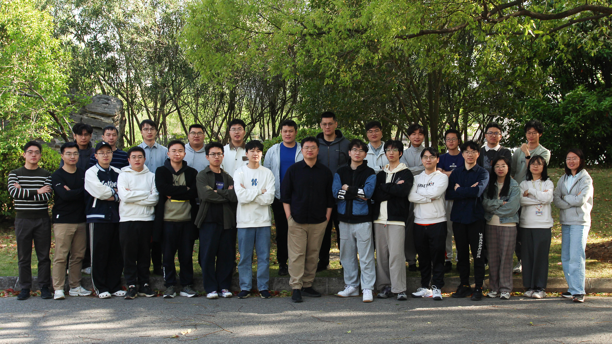

# Welcome to CiH-Lab @ FDU !

The CiH lab is from [College of Integrated Circuits and Nano-Micro Electronics（集成电路与微纳电子创新学院）](https://icmne.fudan.edu.cn/) of [Fudan University](http://www.fudan.edu.cn). It also has a strong collabration with [the State Key lab of Integrated Circuits and Systems](https://sklics.fudan.edu.cn/).
Our objective is to develop intelligent hardware, from chips to systems, for emerging applications.
Currently, we target efficient in-memory and processing circuits and system designs for large scale intelligent computing devices.

## News

* _08/22/2026_, Our paper  "Theseus A Ray-Tracing Processor" is accepted by ASSCC 2026 (with highlight) , and “Delta-MoE: Efficiency CPU–GPU MoE Serving" is accepted by ICCAD 2026.
* _07/14/2026_, Our paper "TNT: A Unified LUT-Centric Architecture for Ternary LLM Inference" is accepted by MICRO 2026. 
* _06/29/2026_, Our paper  "A 12nm 80.6TFLOPS/W BF16 FP CIM Macro" is accepted by ESSERC 2026 (previously ESSCIRC) , and “AMBER: Thermal-Aware Edge LLM 3D DRAM-on-NPU Design" is accepted by AICAS 2026.
* _05/30/2026_, Prof. [Shiwei Liu](https://see.tongji.edu.cn/info/1391/14706.htm) joined Tongji University as an tenure-track assistant Professor.  Congratulation!
* _03/20/2026_, Two papers get accepted by ISCA 2026, one is 3D Cloud Point Processing, and the other is 3D Gaussian Processing, congratulations!
* _02/10/2026_, One Neural Machine Interface (spike sorting processor) get accepted by TCAS-I, and One CIM paper get accepted by OJ-SSCS, and One Transformer SoC get accepted by JETCAS (extended by ISSCC 2023 paper).
* _10/02/2025_, Our ISSCC 2025 SHINSAI paper gets invited and accepted by JSSC 2026 Special Issue.
* _09/01/2025_, Our paper Real-time Robot engine for Embodied Intelligience get accepted by A-SSCC 2025. 
* _07/01/2025_, Our paper "GauPRE: A Pattern-based Rendering Engine for 3DGS", and get accepted by ICCAD 2026 and recognized by the Best Paper Award Candidate.
* _06/01/2025_, Our paper "Outlier-CiM" and "RRAM/SRAM CIM for fine-tuning" are accepted by IEEE JSSC.

[More](./news.md)

## Publication

[Selected Publication List](./pub.md)

## Teaching 

[Advanced Package and Integrated Chips @ 2025 Spring](./course/chiplet25.md)

[Intelligent Computing Chips @ 2025 Spring](https://elearning.fudan.edu.cn/courses/88552) 

[More courses in history](./course/teaching_history.md)

## People

Faculty Member: [Chixiao Chen](./cxchen.md) (email:cxchen@fudan.edu.cn ) 
and [Haozhe Zhu](https://fics.fudan.edu.cn/e1/98/c22620a450968/page.htm)  (email:zhuhz@fudan.edu.cn ) 
and [Shiwei Liu](https://scholar.google.com/citations?user=example) (Tongji University) 

Post Doc / Research Associate:  Liyu Lin, Saifei Gou 

## Positions

We are looking for undergrad/master/Ph.D students with background of EE/CS, especially IC design, embedded, computer archiecture and alorightms. 
However, I cannot offer more than 1-2 Ph.Ds per year, which makes it a hard decision. 
As a result, since 2025, I will organize a pre-summer-camp exam after a CV review. Please make sure you are OK with the precedure.

